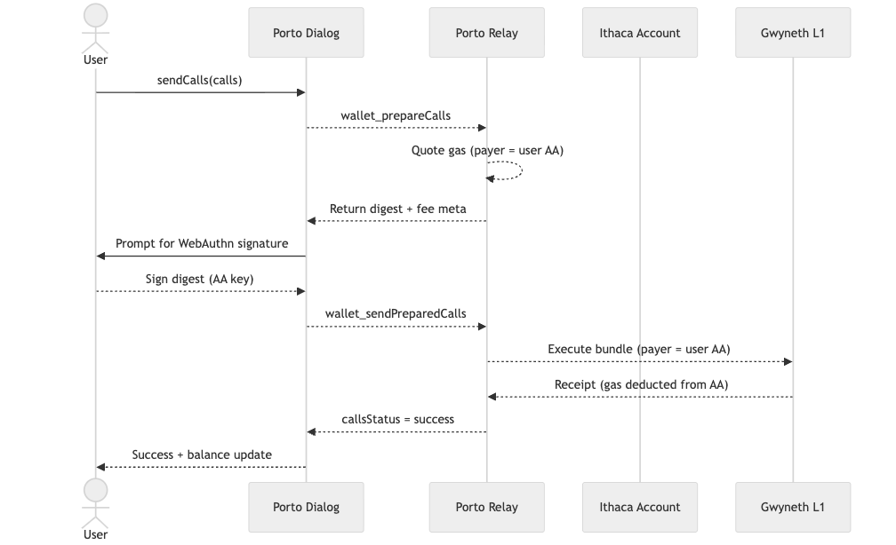
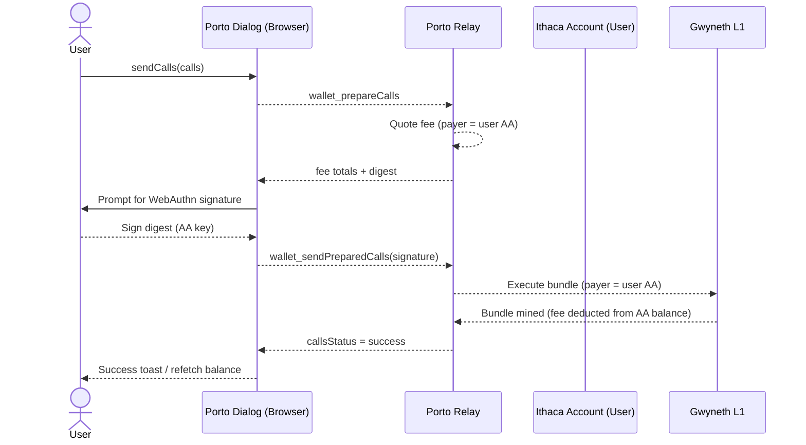
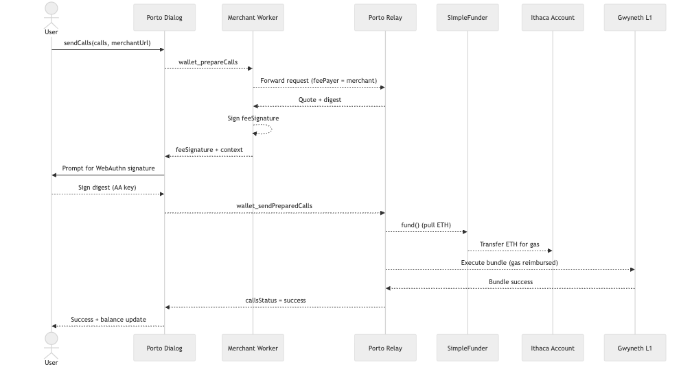
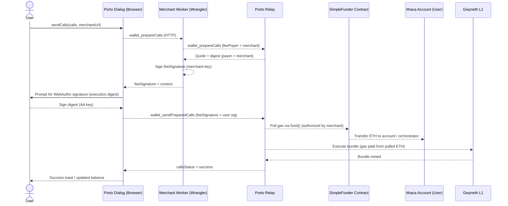

# Porto ↦ Gwyneth Transaction Flows

This companion note complements `ACTUAL_WORKING_DEPLOYMENT.md` and focuses on
what actually happens when a user submits a transaction with, or without,
merchant sponsorship. Both flows assume the user already upgraded to an Ithaca
smart account (AA proxy) on Gwyneth.

### Entry Points: Orchestrated vs Self-Service

| Route | Who starts the tx? | What validates the signature? | How gas can be sponsored? |
| ----- | ------------------ | ----------------------------- | ------------------------- |
| **Orchestrated** | Any relayer or app calling `Orchestrator.execute` (e.g. Porto Relay) | Orchestrator calls `unwrapAndValidateSignature` on the Ithaca Account before forwarding (`contracts/account/src/Orchestrator.sol:470`, `contracts/account/src/IthacaAccount.sol:496`) | Yes—intent carries `payer`, `paymentToken`, and `paymentAmount`; Orchestrator pulls funds or asks the account to pay (`contracts/account/src/Orchestrator.sol:658`) |
| **Self-service** | User (or automation) sends an on-chain tx directly to their account’s `ERC7821.execute` | Ithaca Account validates the signature inside the `_execute` override when `msg.sender != ORCHESTRATOR` (`contracts/account/lib/solady/src/accounts/ERC7821.sol:59`, `contracts/account/src/IthacaAccount.sol:704-724`) | Generally no—caller funds the transaction, though the account can still pay itself inside the batch |

- **Why two paths?** The orchestrated path enables meta-transactions: third parties can sponsor gas, bundle precalls, or run multi-chain settlements before the account executes. The self-service path keeps the account usable like any smart wallet—if the orchestrator is offline or the user wants a plain transaction, they can call `execute` directly and rely on the account’s built-in signature checks.
- **How this document relates:** All sponsorship flows below assume the orchestrated route. Unsponsored mode simply sets `payer = eoa`, so the account reimburses gas even though the orchestrator still handles verification. Self-service calls bypass the orchestrator entirely; whoever submits the transaction must cover the L1 fee.

---

## 1. Unsponsored Flow (User Pays Gas)

When no `merchantUrl` is provided to the connector, the relay quotes gas against
the user’s own account. The merchant worker and `SimpleFunder` contract are not
involved.

**Key points**

- The account that signs is the user’s upgraded Ithaca Account; it always
  remains an AA proxy even when sponsorship is disabled.
- Gas comes directly from the account’s configured fee token (typically native
  ETH). Make sure the user AA holds enough ETH before calling `sendCalls`.
- `SimpleFunder` is unused—its ETH balance remains untouched.
- No merchant RPC or signature is required; `wallet_prepareCalls` talks directly
  to the relay’s public endpoint.

---

## 2. Sponsored Flow (Merchant Pays Gas)

When the connector is given `merchantUrl`, the dialog asks the merchant worker
for a sponsorship quote. The worker signs the fee authorization, while the relay
withdraws the actual gas from the pre-funded `SimpleFunder` contract during
execution.

**What is really paying for gas?**

- The merchant worker (`MERCHANT_ADDRESS`) only signs the fee authorization
  (`feeSignature`). Its balance never changes because it does not broadcast an
  on-chain transaction.
- `SimpleFunder` (`config.gwyneth-addresses.json -> funder`) holds the ETH that
  actually covers priority + base fee. During execution the Orchestrator invokes
  `SimpleFunder.fund(...)`, which transfers ETH to settle gas costs.
- As long as `SimpleFunder` has ETH, the merchant can approve sponsorships
  without their EOA balance moving.

**What if `SimpleFunder` is empty?**

- The relay returns `PaymentError`, mirroring the behaviour you saw earlier.
  Top up the funder (`cast send <funder> --value X`) or disable sponsorship so
  the user account pays.

---

## 3. Summary Table

| Aspect                          | Unsponsored                                         | Sponsored                                                     |
| ------------------------------- | --------------------------------------------------- | ------------------------------------------------------------- |
| Uses merchant worker            | No                                                  | Yes (`merchantUrl` required)                                  |
| Who signs fee authorization?    | User AA only                                        | Merchant worker signs `feeSignature`                          |
| Where does ETH come from?       | User AA balance                                     | `SimpleFunder` contract (prefunded during deployment)         |
| Merchant EOA balance changes?   | n/a                                                 | No – signature only                                           |
| Smart account still required?   | Yes (always an Ithaca Account)                      | Yes (same account, but gas reimbursed)                        |
| Failure mode                    | Insufficient user ETH                               | Empty `SimpleFunder` or missing merchant signature            |

Use this sheet whenever you need to reason about fee flows or explain the
meaning of the merchant worker versus the on-chain funder.

---

## 4. Passkeys, Biometrics, and Ithaca Accounts

- **Passkey != EOA address.** The WebAuthn credential (stored in FaceID/TouchID
  or a hardware key) only holds the private key material used to sign upgrade
  digests and runtime bundles. The on-chain account is still the Ithaca smart
  account address published during the upgrade flow.
- **Biometric sign-in is a client-side unlock.** When the user approves a
  transaction, the dialog asks the platform authenticator to produce a signature
  with that passkey. Biometrics never leave the device; the resulting signature
  over the digest is what the relay verifies.
- **Porto stitches the pieces together.** After receiving the WebAuthn
  signature, Porto wraps it into the bundle sent to the relay (along with the
  merchant’s `feeSignature`, if any). The relay then executes the call on behalf
  of the Ithaca Account.
- **Sponsorship is optional.** Whether or not a merchant is involved, the user
  continues to sign with the same passkey and the same smart account executes
  the call. Sponsorship merely changes who reimburses gas.

### Signature Types the Ithaca Account Understands

- **WebAuthn (P-256).** Default in Porto Dialog. FaceID/TouchID merely unlocks
  the WebAuthn credential, which produces an ECDSA signature over a pre-hashed
  digest. The relay wraps it into the bundle and the Ithaca Account verifies it
  against the stored admin key via ECDSA-P256.
- **Secp256k1 EOA keys.** You can authorize an admin key backed by a plain
  secp256k1 private key (`porto viem Key.createSecp256k1`). In that case the user
  signs with their raw EOA (e.g. Ledger, MetaMask) and the Ithaca Account verifies
  the signature using regular Ethereum secp256k1 rules.
- **Session keys / permissions.** Additional keys can be provisioned with spend
  limits (e.g. for delegates or automated flows). During `prepareCalls` Porto
  picks whichever key matches the call permissions. The smart account checks the
  signature against the corresponding permission slot before executing.

The account proxy doesn’t care *how* the signature was produced—only that it
matches a key/hash it knows about. Porto’s job is to normalize the signature from
FaceID, a hardware key, or a raw private key into the format the relay/Ithaca
Account expect.

### Where “Stored Admin Keys” Come From

- During `prepareUpgradeAccount`, Porto bundles the initial administrator keys
  (by default the freshly created WebAuthn key). Those keys get encoded into the
  initialization pre-call.
- When `wallet_upgradeAccount` runs, the Orchestrator executes that pre-call and
  writes the key metadata into the smart account’s storage—role, permissions,
  and hash. That’s the “stored admin key” the account checks against later.
- Additional admin or session keys can be added or revoked after deployment via
  `authorizeKeys` / `revokeKeys` flows; the account simply keeps its key table in
  storage and validates signatures against it.

### Resetting Passkeys During Local Development

- Browsers treat `https://127.0.0.1:<port>` and `https://localhost:<port>` as
  distinct WebAuthn Relying Parties. If you restart the demo with a new port or
  profile, Chrome may reuse an old passkey and therefore an old Ithaca Account
  address.
- To start fresh, open `chrome://password-manager/passkeys` (or the OS passkey
  manager on macOS) and delete the entries named `127.0.0.1`/`localhost` before
  reconnecting.
- Always choose “Select existing account” in the Porto dialog if you want to
  reuse the already-upgraded account. Choosing “Create account” generates a new
  address that must go through the upgrade flow again.
- If the dialog never surfaces the upgrade step, use the helper in
  `docs/ACCOUNT_UPGRADE.md` (paste it in the browser console) to run
  `prepareUpgradeAccount`/`wallet_upgradeAccount` manually. Verify the account is
  deployed with `cast code <address> --rpc-url http://localhost:32002` before
  retriggering the mint.
- Quotes from the relay expire quickly (≈30 seconds). If you take too long to
  approve the passkey prompt, `relay_sendPreparedCalls` returns
  `quote expired` and the upgrade pre-call never executes. Retry immediately to
  fetch a fresh quote, or request the faucet first so you can approve without
  delay.

---

## 5. Future Integration Notes (Gwyneth Cross-Chain Contracts)

This section seeds the context for wiring Porto’s orchestrated intents into the
bespoke Gwyneth cross-chain stack. Recall that every contract deployed on L1 is
also reachable on each L2 execution shard (stateless on L2), so we can invoke
the same bytecode from different chain IDs via the `xCallOptions` precompile.

### 5.1 Modified Uniswap V2 Artifacts

- **`script/SimpleXTransfer.s.sol:11`** casts a local TAIKO token and pushes it
  from L1 (chainId `160010`) to L2A (`167010`) through `xERC20.xTransfer`. It
  depends on `EVM.onChain` to swap the call target to the extension oracle when
  the destination chain differs from `block.chainid`.
- **`src/erc20/EVM.sol:6`** hardcodes the `0x04D2` precompile. Each overload of
  `xCallOptions` encodes chain ID, original caller, and optional proofs before
  issuing a `staticcall`. The library swaps outbound calls to the extension
  oracle at `0x1ADB…` so that the L2 copy of the contract can finish the work
  without state.
- **`src/erc20/CoreXERC20.sol:12`** adds cross-chain mint/burn helpers that only
  succeed when the contract calls itself. After burning on the source chain, the
  helper re-enters the destination chain’s stateless copy to `_mintCrossChain`.
- These components currently assume `tx.origin` and `msg.sender` reflect the
  original L1 signer. When the Porto Orchestrator relays an intent, `tx.origin`
  will be the relayer EOA; we need to confirm with the precompile spec whether
  that is acceptable or whether we must plumb the user address via `sandbox`
  inputs or an override.

### 5.2 `packages/protocol` X-Deploy Script

- **`scripts/xDeployAndTest.s.sol:38`** deploys an `xERC20` instance, then runs a
  matrix of ETH and token transfers across the parent chain and two L2 shards
  (`167010`, `167011`).
- Helper functions such as `transferAndCheck` and `_transferETHAndCheck`
  simulate hops `(L1 → L2)`, `(L2A → L2B)`, and withdrawals by broadcasting from
  the appropriate per-chain `ChainAddr`. The script reuses the same `EVM` helper
  to redirect execution and relies on `GwynethContract.gwynethForwarder`
  (`contracts/gwyneth/GwynethContract.sol:4`) to accept delegated calls from the
  extension oracle.
- Because every chain reuses the L1 bytecode, all storage writes must originate
  from L1; the L2 invocations treat the contract as stateless. The script
  demonstrates this by asserting balances via `token_on(chain_id)` after each
  hop.

### 5.3 Rough Plan: Porto ↔ Cross-Chain Contracts

1. **Meta-transaction entry.** Have the user sign a Porto intent whose single
   call targets `xERC20.xTransfer` (or a higher-level Uniswap router) on L1. The
   orchestrated path remains ideal: the relayer can sponsor the gas-heavy `xCall
   + mint` sequence while the account signature proves user consent.
2. **Call envelope adjustments.** Extend the intent builder to include the
   desired `chainId` pair and recipient. Wrap these parameters in the ERC7821
   batch so the Ithaca Account invokes `xERC20.xTransfer(chainIdParent,
   destChain, recipient, amount)`. Evaluate whether we must add a pre-call that
   stores the user address in transient storage so `EVM.xCallOptions` can send it
   to the precompile when `tx.origin` is the relayer.
3. **Relay and sponsorship.** Reuse the orchestrated payment fields if the DEX
   wants to sponsor the transfer. For pure self-service flows, instruct the
   front-end to send the transaction directly to `execute` instead of going
   through the relay.
4. **L2 observation.** Because L2 copies are stateless, we likely need an off-
   chain watcher (or extend the relayer) to observe the emitted events on the
   extension oracle and reconcile balances. This could live alongside the
   merchant worker so that the same component can top up relayer gas and monitor
   cross-chain settlement.
5. **Touchpoints to revisit.**
   - Confirm the `xCallOptions` precompile tolerates relayer `tx.origin` values
     or whether it expects the user EOA.
   - Decide where to deploy glue contracts—either wrap Uniswap pools in a Porto
     friendly adapter or call routers directly from the Ithaca Account.
   - Map out how Porto’s multisig/session key model plays with cross-chain
     transfers; L2 scripts assume globally shared storage, so guardrails may be
     needed before allowing automated spending.

Add follow-up notes here as we build the custom relayers and deploy contracts to
additional shards.
